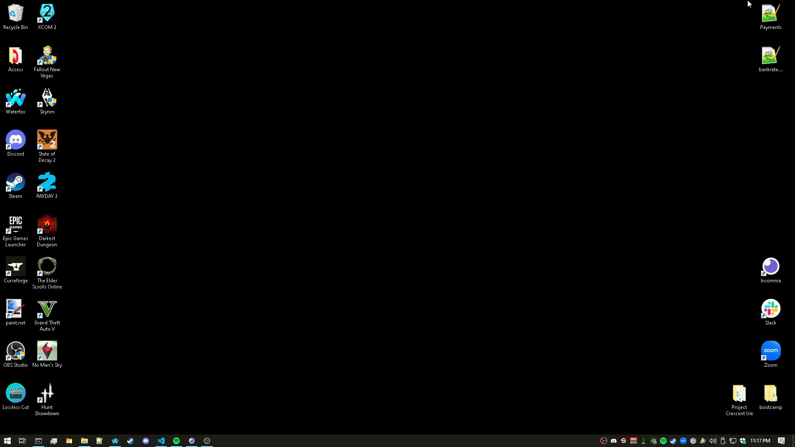

# e-commerce-back-end

## Table of Contents

- [Description](#Description)
- [Installation](#Installation)
- [Usage](#Usage)
- [Test Instructions](#Test_Instructions)
- [License](#License)
- [Questions?](#Questions?)

## Description

My very own diabolical example e-commerce database terminal application. Made using the criteria from Module 13 of my edX Web Development bootcamp. I made it as compact as possible within my tight time limit I had.
The application allows users to build, access, and modify an example database of products, tags, categories, and their associated data.

## Installation

Download the project via your preferred means, then drag it into it's own directory on your machine.

## Usage

0. Have a working instance of MySQL on your local machine, specifically that uses "root" permissions and username.
1. Create your own .env file using .env.example as an example, but inputting your own password inside the necessary fields inside your .env.
2. Boot your bash terminal from the project's installed directory.
3. Log into your mySQL via inputting the command "mysql -u root -p".
4. Input and enter the command "source ./db/schema.sql", then exit mySQL via inputting the command "\q".
5. Input and enter the command "npm i", then input and enter the command "node run seed", followed by "node run start" to run the program.
6. Interface with the now booted database via Insomnia, or an application like it.

## Demonstration

## License

This project is protected under the MIT License.

## Questions?

Reach out to me either on [GitHub](https://github.com/NoahJRalph) or by [Email](mailto:NoahJRalph@gmail.com).
